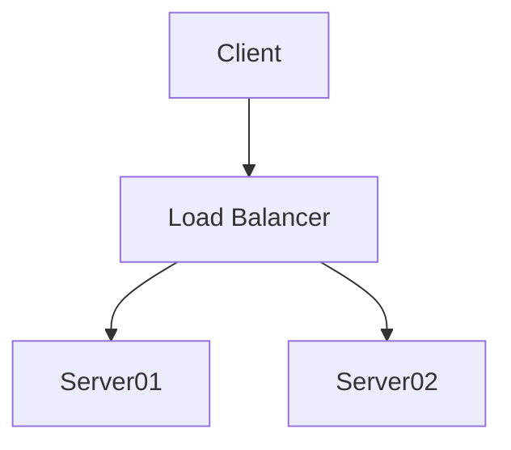

# Welcome to MkDocs

For full documentation visit [mkdocs.org](https://www.mkdocs.org).

## Commands

* `mkdocs new [dir-name]` - Create a new project.
* `mkdocs serve` - Start the live-reloading docs server.
* `mkdocs build` - Build the documentation site.
* `mkdocs -h` - Print help message and exit.

## Project layout

```
mkdocs.yml    # The configuration file.
docs/
    index.md  # The documentation homepage.
    ...       # Other markdown pages, images and other files.
```

## Abbreviations

The HTML specification is maintained by the W3C.

--8<--
includes/abbreviations.md
--8<--

## Admonition

!!! note
    Lorem ipsum dolor sit amet, consectetur adipiscing elit. Nulla et euismod
    nulla. Curabitur feugiat, tortor non consequat finibus, justo purus auctor
    massa, nec semper lorem quam in massa.

## Code Highlighting and Line Number

```python linenums="1"
def bubble_sort(items):
    for i in range(len(items)):
        for j in range(len(items) - 1 - i):
            if items[j] > items[j + 1]:
                items[j], items[j + 1] = items[j + 1], items[j]
```

## Math

$$
\operatorname{ker} f=\{g\in G:f(g)=e_{H}\}{\mbox{.}}
$$

## Footnote

Lorem ipsum[^1] dolor sit amet, consectetur adipiscing elit.

[^1]: Lorem ipsum dolor sit amet, consectetur adipiscing elit.

## Keys

++ctrl+enter++

## Tabs

=== "Tab 1"
    - One
    - Two

=== "Tab 2"
    - One
    - Two

## Mermaid Diagram

